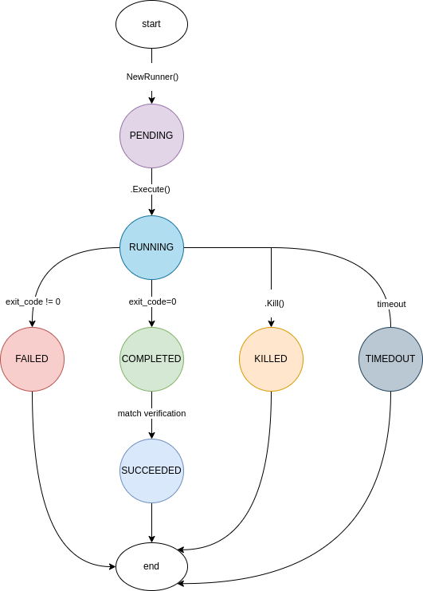

# Runner

A runner is a custom go component, designed to help execute system commands, say `ls -al |grep main` in golang with better control and ease.

 

### Properties

| Parameters             | Datatype     | Access  | spec              | Sample value                              | Usage                                                                                                                                                                               | Mehtods associated                              |
| ---------------------- | ------------ | ------- | ----------------- | ----------------------------------------- | ----------------------------------------------------------------------------------------------------------------------------------------------------------------------------------- | ----------------------------------------------- |
| `id`                   | string       | private | autogenerated     | "20ad0fe445e0fd6e597b7a1ac102a35e"        | Uniqie id of each unner instance                                                                                                                                                    | .getState()                                     |
| `isConsole`            | bool         | private | optional-setting  | false                                     | If set ture, system commands output will be printed on console. default=false (disabled                                                                                             | .EnableConsole(), .DisableConsole), .getState() |
| `timeout`              | int          | private | optional-setting  | 9                                         | Runner will force terminate the system command execution if it exceeds <n> seconds. ddefault=0 (no-timeout)                                                                         | .SetTimeout(), .getState()                      |
| `waitingPeriod`        | int          | private | optional-setting  | 3                                         | Runner will wait <n> seconds before executing. default=0 (no delay)                                                                                                                 | .SetWaitingPeriod(), .getState()                |
| `logFile`              | string       | private | optional-setting  | "log.md"                                  | Running will write STDOUT of the system call in this file. default="" (file logging disabled)                                                                                       | .SetLogFile()                                   |
| `execuitedAt`          | int64        | private | system-generated  | 1693137765180789285                       | The timestamp of the beginning of the command execution (epoch nanosecond). default=0                                                                                               | .getState()                                     |
| `executionTimeNano`    | int64        | private | system-generated  | 10001158509                               | Execution time / duration of the system call (in nanoseconds). default=0                                                                                                            | .getState()                                     |
| `verificationPhrase`   | string       | private | optional-setting  | "Ready"                                   | User can provide a phrase/string. the runner will match this string in the output of the system call. if found then state=SUCCESSFUL. default="" (no verification)                  | .SetVerificationPhrase(), .getState()           |
| `status`               | string       | private | system-generated  | "PENDING"                                 | The current state of the runner. possible states: PENDING \| RUNNING \| COMPLETED \| FAILED \| TIMEDOUT \| SUCCEEDED \| KILLED. default=PENDING                                     | .GetStatus(), .GetState()                       |
| `sysCmd`               | string       | private | mandatory-input   | "ping google.com -c 4"                    | The system command the user must provide to run                                                                                                                                     | .NewRunner(), .GetState()                       |
| `logBuffer`            | []byte       | private | system-generated  |                                           | The `STDOUT` content of the system call is stored here.                                                                                                                             | .Logs(), .ClearLogs()                           |
| `cmd`                  | *exec.Cmd    | private | internal-usage    |                                           |                                                                                                                                                                                     |                                                 |
| `onNewLogLineCallback` | func([]byte) | private | optional-callback | func logCallback (logLine []byte) {}      | If attached, an user-defined callback function will be called every time the system call generates a new line in `STDOUT`. the new line will be injected into the callback function | .SetOnNewLineCallback()                         |
| `onSuccessCallback`    | func([]byte) | private | optional-calback  | func successCallback (logLine []byte) {}  | If attached, an user-defined callback function will be called if the user-provided verification phrase is found in the output of the system call.                                   | .SetOnSuccessCallback()                         |
| `onCompleteCallback`   | func([]byte) | private | optional-callback | func completeCallback (logLine []byte) {} | If attached, an user-defined callback function will be called if and when the system call exits with exit-code=0 and verification is disabled                                       | .SetOnCompleteCallback()                        |
| `onFailCallback`       | func([]byte) | private | optional-callback | func failCallback (logLine []byte) {}     | If attached, an user-defined callback function will be called if and when the system call exits with a non-zero status-code                                                         | .SetOnFailCallback()                            |
| `onTimeoutCallback`    | func([]byte) | private | optional-callback | func timeoutCallback (logLine []byte) {}  | If attached an user-defined callback function will be called if and when the system call times out                                                                                  | .SetOnTimeoutCallback()                         |


### Methods

| Methods                                                            | Input-desc                                                                                                            | Output-desc                                 | Function                                                                                                                                                       |
| ------------------------------------------------------------------ | --------------------------------------------------------------------------------------------------------------------- | ------------------------------------------- |:--------------------------------------------------------------------------------------------------------------------------------------------------------------:|
| `func NewRunner(cmd string) *Runner {}`                            | the system command that                                                                                               | runner object instance                      | Instantiate a new runner object                                                                                                                                |
| `func(r *Runner) EnableConsole() {}`                               |                                                                                                                       |                                             | Enable console logging. if enabled, the system call's output will be printed to console                                                                        |
| `func(r *Runner) DisableConsole() {}`                              |                                                                                                                       |                                             | Disable console login                                                                                                                                          |
| `func(r *Runner) SetTimeout(timeout int) {}`                       | timeout in seconds                                                                                                    |                                             | Set execution timeout (in seconds)                                                                                                                             |
| `func(r *Runner) SetWaitingPeriod(wp int) {}`                      | waiting-period in seconds                                                                                             |                                             | If set runner will wait these many seconds before execuiting the system command                                                                                |
| `func (r *Runner) SetLogFile(file string) {}`                      | name of the log file                                                                                                  |                                             | If set, then the runner will create (or open) a log file with the provided name and will insert each command and its output in that file.                      |
| `func (r *Runner) SetVerificationPhrase(phrase string) {}`         | a phrase "string" that is expected to be in the system call's output for the system call to be qualified as a success |                                             | If set, the runner will search the provided phrase in the system-call's output. If found then the state will become `SUCCEEDed`                                |
| `func (r *Runner) SetOnNewLineCallback(callback func([]byte)) {}`  | an user-defined function                                                                                              |                                             | If attached, an user-defined function will be called every time the system call generates a new line. The new line will be injected into the attached function |
| `func (r *Runner) SetOnSuccessCallback(callback func([]byte)) {}`  | an user-defined function                                                                                              |                                             | If attached, an user-defined callback function will be called if the user-provided verification phrase is found in the output of the system call.              |
| `func (r *Runner) SetOnCompleteCallback(callback func([]byte)) {}` | an user-defined function                                                                                              |                                             | If attached, an user-defined callback function will be called if and when the system call exits with exit-code=0 and verification is disabled                  |
| `func (r *Runner) SetOnFailCallback(callback func([]byte)) {}`     | an user-defined function                                                                                              |                                             | If attached, an user-defined callback function will be called if and when the system call exits with a non-zero status-code                                    |
| `func (r *Runner) SetOnTimeoutCallback(callback func([]byte)) {}`  | an user-defined function                                                                                              |                                             | If attached an user-defined callback function will be called if and when the system call times out                                                             |
| `func (r *Runner) GetState() map[string]interface{} {}`            |                                                                                                                       | returns all the parameters                  | Is used mostly for debugging                                                                                                                                   |
| `func (r *Runner) GetStatus() string {}`                           |                                                                                                                       | returns the current status (e.g. `RUNNING`) | Using this method one can chain multiple sequential commands with conditional branching. e.g. onSuccess() execute the next command and onFailure() retry       |
| `func (r *Runner) Execute(commands ...string) ([]byte, error) {}`  | optinal - one or more system comands to execute                                                                       | log, error                                  | This is the main method that executes the system-call                                                                                                          |
| `func (r *Runner) Logs() string {}`                                |                                                                                                                       | returns the output of the system call       | returns the output of the system call                                                                                                                          |
| `func (r *Runner) ClearLogs() {}`                                  |                                                                                                                       |                                             | This will clear the output of the system call                                                                                                                  |
| `func (r *Runner) Kill() {}`                                       |                                                                                                                       |                                             | This will kill a running system call prematurely and on-demand                                                                                                 |


### State diagram

The diagram bellow, illustrates different states the runner object can be in and what causes the state to change. 



### Usage

 

Import `gocomponents` library

```shell
go get -u github.com/tuhin37/gocomponents
```

 

Instantiate a new `Runner` object

```go
runr = runner.NewRunner("ping google.com -c 4")
```

 

Apply optional settings

```go
runr.SetLogFile("log.md")                // set log file name
runr.SetVerificationPhrase("created")    // set verification phrase 
runr.EnableConsole()                     // enable logs on console  
runr.SetWaitingPeriod(10)                // set waiting period of 10 s
runr.SetTimeout(5)                       // set timeout of 5 s
```


Optionally define a callback function that will be invoked ever time there is a new log line generated by the system call. Also the new line will be injected into the callback function

```go
func logCallback(logLine []byte) {
	fmt.Println("Log: ", string(logLine))
}
```


Attach the above function as a Log-callback function to the runner

```go
runr.SetOnNewLineCallback(logCallback)
```

 

Execute the runner with the command pre loaded

```go
stdout, err := runr.Execute()
```


Optionally, execute the runner with a custom command supplied as input argument

```go
stdout, err := runr.Execute("ls -al |grep jpg")
```


Optionally, execute with multiple commands provided as input argument

```go
stdout, err := runr.Execute("sudo apt update", "sudo apt upgrade", "sudo apt dist-upgrade")
```


Execute in the background

```go
go runr.Execute("ls -al")
```


Get current parameters

```go
runr.GetState()
```

Output (sample)

```go
{
    "console": false,
    "execuited_at": 1693137765180789285,
    "execution_time_nano": 10001158509,
    "file_path": "log.md",
    "id": "20ad0fe445e0fd6e597b7a1ac102a35e",
    "log_size_bytes": 956,
    "status": "TIMEDOUT",
    "system_command": "ping google.com -c 20",
    "timeout": 0,
    "verification_phrase": "",
    "waiting_period": 0
}
```


Get current status

```go
runr.GetState()
```


Kill on demand

```go
runr.Kill()
```


---

## Example code

Here is a sample code with gin framework to showcase few use cases.

```go
package main

import (
	"encoding/json"
	"fmt"
	"log"

	"github.com/gin-gonic/gin"
	"github.com/tuhin37/gocomponents/runner"
)

// declear a global runner object
var runr *runner.Runner

func init() {
	runr = runner.NewRunner("ping google.com -c 4") // instantiate the runner object
	runr.SetLogFile("log.md")                       // logfile name; if not defined, file logging disabled
	runr.SetVerificationPhrase(".go")               // verification phrase, if found in the output then status - > SUCCEEDED
	runr.EnableConsole()                            // the system output will be printed on console
	runr.SetWaitingPeriod(10)                       // wait 10s before execuiting
	runr.SetTimeout(5)                              // set timeout of 5s.

	runr.SetOnNewLineCallback(logCallback) // set callback function
}

func main() {
	r := gin.Default()

	// routes
	r.POST("/exec-payload", execPayload)
	r.GET("/exec", exec)
	r.POST("/exec-payload-async", execPayloadAsync)
	r.GET("/state", getState)
	r.GET("/status", getStatus)
	r.GET("/kill", kill)

	r.Run(":5000")
}

// controllers
func getState(c *gin.Context) {
	c.AsciiJSON(200, runr.GetState())
}

func getStatus(c *gin.Context) {
	c.AsciiJSON(200, runr.GetStatus())
}

func kill(c *gin.Context) {
	runr.Kill()
	c.AsciiJSON(200, runr.GetStatus())
}

func execPayload(c *gin.Context) {
	// Read the request body
	requestBodyBytes, err := c.GetRawData()
	if err != nil {
		log.Println("Error reading request body:", err)
		c.JSON(500, gin.H{"error": "Internal Server Error"})
		return
	}

	// Parse the request body JSON into a map
	var data map[string]string
	if err := json.Unmarshal(requestBodyBytes, &data); err != nil {
		log.Println("Error parsing JSON:", err)
		c.JSON(400, gin.H{"error": "Bad Request"})
		return
	}

	command := data["instruction"]
	_ = command

	// ATP: command holds the system call command. e.g. "ls -al | grep main && tree ."
	stdout, _ := runr.Execute(command)
	c.String(200, string(stdout))
}

func exec(c *gin.Context) {
	// ATP: command holds the system call command. e.g. "ls -al | grep main && tree ."
	stdout, _ := runr.Execute()
	c.String(200, string(stdout))
}

func execPayloadAsync(c *gin.Context) {
	// Read the request body
	requestBodyBytes, err := c.GetRawData()
	if err != nil {
		log.Println("Error reading request body:", err)
		c.JSON(500, gin.H{"error": "Internal Server Error"})
		return
	}

	// Parse the request body JSON into a map
	var data map[string]string
	if err := json.Unmarshal(requestBodyBytes, &data); err != nil {
		log.Println("Error parsing JSON:", err)
		c.JSON(400, gin.H{"error": "Bad Request"})
		return
	}

	command := data["instruction"]
	_ = command

	// ATP: command holds the system call command. e.g. "ls -al | grep main && tree ."
	go runr.Execute(command)

	c.String(200, "ok")
}

// callback function
func logCallback(logLine []byte) {
	fmt.Println("Log: ", string(logLine))
}

```


#### Test

Execute blocking

```shell
curl --location 'http://127.0.0.1:5000/exec'
```


Response

```json
PING google.com (172.217.166.110) 56(84) bytes of data.
64 bytes from maa05s09-in-f14.1e100.net (172.217.166.110): icmp_seq=1 ttl=118 time=16.9 ms
64 bytes from maa05s09-in-f14.1e100.net (172.217.166.110): icmp_seq=2 ttl=118 time=26.7 ms
64 bytes from maa05s09-in-f14.1e100.net (172.217.166.110): icmp_seq=3 ttl=118 time=21.9 ms
64 bytes from maa05s09-in-f14.1e100.net (172.217.166.110): icmp_seq=4 ttl=118 time=22.9 ms

--- google.com ping statistics ---
4 packets transmitted, 4 received, 0% packet loss, time 3003ms
rtt min/avg/max/mdev = 16.890/22.102/26.663/3.488 ms

```


Execute blocking with custom command payload

```shell
curl --location 'http://127.0.0.1:5000/exec-payload' \
--header 'Content-Type: application/json' \
--data '{
    "instruction": "ls -al |grep main"
}'
```


Response

```json
-rw-r--r--  1 drag drag 2919 Aug 28 16:45 main.go
```


Execute async with custom payload

```shell
curl --location 'http://127.0.0.1:5000/exec-payload-async' \
--header 'Content-Type: application/json' \
--data '{
    "instruction": "tree ."
}'
```


Response

```json
ok
```


Get current settings

```shell
curl --location 'http://127.0.0.1:5000/state'
```


Response

```json
{
    "console": true,
    "execuited_at": 1693221850593927888,
    "execution_time_nano": 6292534,
    "file_path": "log.md",
    "id": "172ac965ab5c52e7d83a4af59dae77ba",
    "log_size_bytes": 93,
    "status": "SUCCEEDED",
    "system_command": "tree .",
    "timeout": 5,
    "verification_phrase": ".go",
    "waiting_period": 10
}
```


Get current status

```shell
curl --location 'http://127.0.0.1:5000/status'
```


Response

```json
"SUCCEEDED"
```


Kill a ongoing system call

```shell
curl --location 'http://127.0.0.1:5000/kill'
```


Reponse

```json
"KILLED"
```