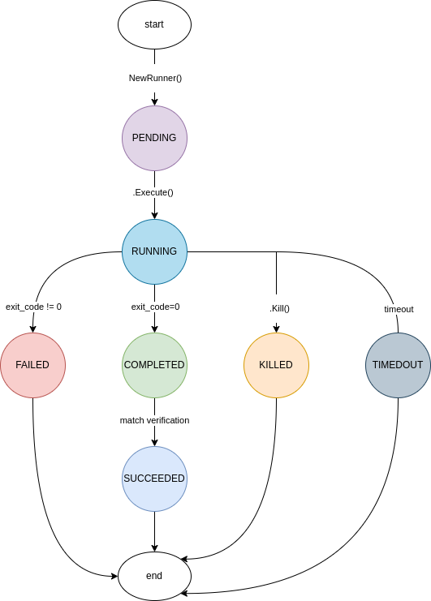

# Runner example - Config / Settings

A runner object consists of several readable and writable properties. These properties serve as settings, and varying their values determines the behavior of the runner instance. You can utilize the `.GetConfig()` method to generate a map containing all the configuration properties. This allows you to programmatically access a runner's properties.

---

Example 

```go
package main

import (
    "fmt"

    "github.com/tuhin37/gocomponents/runner"
)

var runr *runner.Runner

func init() {
    runr = runner.NewRunner("ls -l")
    runr.EnableConsole()
    runr.SetWaitingPeriod(4)
    runr.SetSuccessCriteria("foo")
    runr.SetLogFile("log.md")
}

func main() {
    fmt.Println(runr.GetConfig()) // read configurations of a runner instance
}
```

Output

```shell
map[console-log:true execuited-at:0 execution-time-nano:0 exit-code:0 id:847ef2aa37b7f26b1ee44dbf614c62ee log-file:log.md log-size-bytes:0 status:PENDING success-criteria:foo system-command:ls -l timeout:0 waiting-period:4]
```

Pretty output

```shell
map[
    id: 847ef2aa37b7f26b1ee44dbf614c62ee
    status: PENDING    
    system-command: ls -l
    timeout: 0
    waiting-period: 4
    console-log: true
    log-file: log.md
    success-criteria: foo
    log-size-bytes: 0
    execuited-at: 0
    execution-time-nano: 0
    exit-code: 0        
]
```

---

# Runner example - Status

The `status` property is a unique attribute of a runner instance, automatically generated and managed by the system. Users are only permitted to read this property and cannot modify it. It serves as an indicator of the current state of the runner instance.

Initially, when the runner object is created, its state is automatically set to `PENDING` as the default value. As execution begins, the state transitions to `RUNNING`, signifying active processing. Upon completion of execution, the state changes to `COMPLETED`.

Below is a detailed state diagram for reference.



The diagram illustrates the dynamic nature of the runner object's `status`, which can vary based on its evolution over time and configuration. It's clear that understanding its current state is crucial for programmatically interacting with the runner object.

To facilitate this, we've developed a dedicated method called `.GetConfig()`. This method retrieves the current status of the runner object as a string. For example, it might return `PENDING` to indicate the current state.

---

Example

```go
package main

import (
    "fmt"

    "github.com/tuhin37/gocomponents/runner"
)

var runr *runner.Runner

func init() {
    runr = runner.NewRunner("ls -l")
}

func main() {
    fmt.Println(runr.GetStatus())
}
```

Output

```shell
PENDING
```
