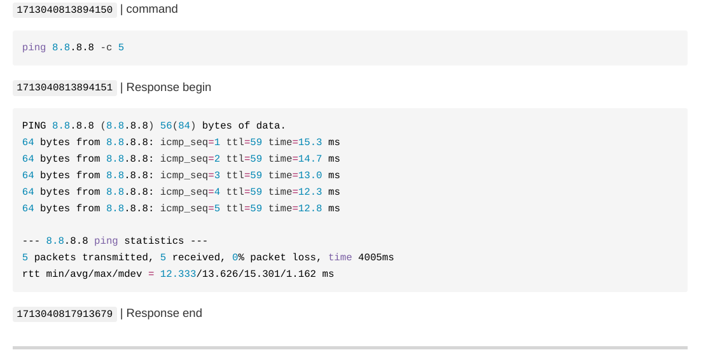
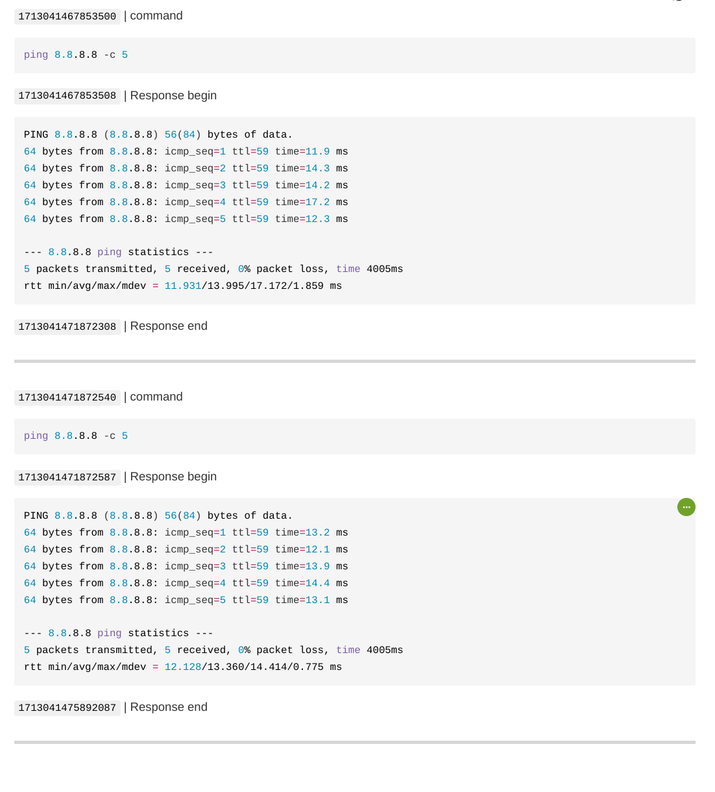

# Runner example - Log File

You can set configure the runner to write logs to a file on the disk. Please note that the log file is written in a markdown format. 

---

Example-1 (single command execution into a log file)

```go
package main

import (
    "github.com/tuhin37/gocomponents/runner"
)

var runr *runner.Runner

func init() {
    runr = runner.NewRunner("ping 8.8.8.8 -c 5")
    runr.SetLogFile("log.md")
}

func main() {
    runr.Execute()
}
```

This code snippet will create a log file named `log.md` in the current directory. It's important to mention that the log file is formatted using Markdown syntax. Below is a screenshot showing how the `log.md` file appears when opened in a Markdown visualizer.

 

The screenshot indicates that the log file records the executed command, the system call response, and the timestamp (in epoch nanoseconds). By developing a parser (TODO: implement parser in goutils), one can extract the command, response, and timestamps for each event. With this data, the parser can compute the execution duration in nano seconds.

---

Example-2 (multiple execution into a log file)

```go
package main

import (
    "github.com/tuhin37/gocomponents/runner"
)

var runr *runner.Runner

func init() {
    runr = runner.NewRunner("ping 8.8.8.8 -c 5")
    runr.SetLogFile("log.md")
}

func main() {
    runr.Execute()
    runr.Execute()
}
```

Please note that the log file is like a on going ledgere. i.e. if the same runner object is execuited multipletimes then logs from both ececuition will be appened in the same `log.md` file. Here is what that looks like



---

Special calses

- You have the flexibility to specify the log filename using an absolute path to create the log file in a specific location of your choice.

- Additionally, you can create multiple runner objects, each configured with the same log file name. When executed, all of these runner objects will push their logs to the same file, ensuring consolidated logging.
