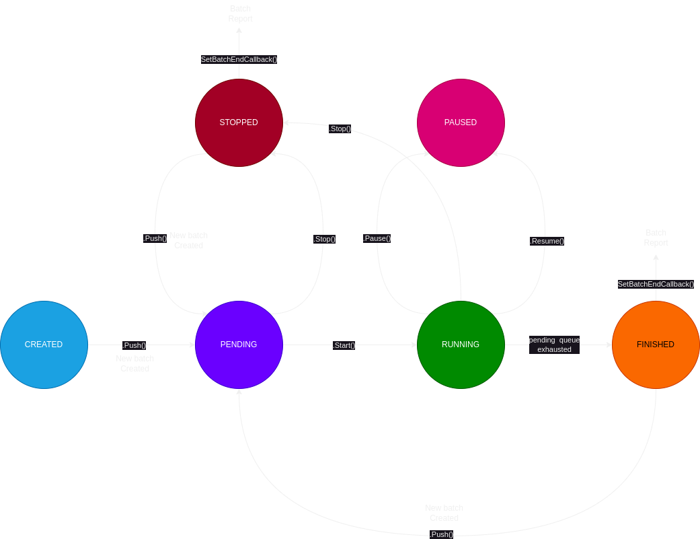

# ServiceQ

---

## 1. Idea

A service queue is similar to a restaurant queue where tasks represent customers waiting to be served. In this analogy, a worker corresponds to the restaurant staff serving the tasks (customers) in the queue. Multiple workers can serve a single queue. The worker pops a task from the queue (first in the queue) and begins working on it.

If the task fails, the worker can retry it for a specified number of times, which we refer to as the retry count. When a task is completed successfully, it is moved to the `passed` queue, and the worker proceeds to the next task. If a task fails repeatedly, it will be moved to the `failed` queue, and the worker will move on to the next task from the `pending` queue. If the `pending` queue is empty, then the worker will push a batch summery and close itself.

## 2. Concepts

### 2.1 Queues

There are 3 queues in a service queue.

1. `pending`. This is the main queue where all the tasks are added.

2. `passed`. This is the queue where all the successfully completed tasks are moved.

3. `failed`. This is the queue where all the failed tasks are moved.

### 2.2 Tasks

A task is a Json object that gets added into gthe serviceQ It can be any json object. For example the task object can be as follows

```json
{
    "country": "india",
    "gender": "male",
     "name": "Tuhin4"
}
```

A bunch of relevent headers gets added to the json task object before it is inserted to the `pending` queue. WIth all the headers added, the task object is called  a Qtask.

Here is what a Qtask looks like.

```json
{
    "task_id": "8f1d1ebc2955f091f36529af46ba40e5",
    "batch_id": "bcc815a75c0cc75324956cb6227a2052",
    "serviceq_id": "ea1d64c967fb1adba1855474d0d86db0",    
    "task": {
        "country": "india",
        "gender": "male",
        "name": "Tuhin4"
    },
    "next_attempt_number": 0,
    "next_attempt_scheduled": 1684528219,
    "created_at": 1684528204,
    "remark": "SUCCESS | the task was finally successful",
}
```

As you can see the Qtask has a unique `task_id`, `batch_id` , `serviceq_id` and more.  Note, when a Qtask object is reported to the user, `next_attempt_number` and `next_attempt_scheduled` are replaced with more relevent `total_retry_attempts` and `last_retry_timestamp`. The first attempt to process the task is not counted as retry rather that considered the first try. If the try fails, then retry begins.

The reported Qtask object looks like this.

```json
{
    "task_id": "8f1d1ebc2955f091f36529af46ba40e5",
    "batch_id": "bcc815a75c0cc75324956cb6227a2052",
    "serviceq_id": "ea1d64c967fb1adba1855474d0d86db0",    
    "task": {
        "country": "india",
        "gender": "male",
        "name": "Tuhin4"
    },
    "total_retry_attempts": 0,
    "last_retry_timestamp": 1684528219,
    "created_at": 1684528204,
    "remark": "SUCCESS | the task was finally successful",
}
```

### 2.3 Retry

The serviceQ can be configured to retry tasks if they fail at the first try. There are three parametes that dictates the retry logic. `restingPeriod`, `retryLimit` & `loopBackoff`. The `restingPeriod` is part of the worker parameters, that dictates how long a worker wait before the next Qtask pop. `retryLimit` specifies how many retry attepmts can be  made by a worker before failing a Qtask. `loopBackoff` controls the staggering of the delay between nth and (n+1)th retty. Here is the formula

```
next_attempt_scheduled = current_epoch + resting_period + ((n-1)*loop_backoff)
```

This calculation is carried out when (n-1)th attempt fails. `restingPeriod` and `loopBackoff` are configurable parameters with default value `0`. This allows the user to configure the retry mechanism.

One can configure the retry mechanism to have a fixed delay between every retry. This can be done by setting `loopBackoff` to `0`.

Also, a serviceQ can be configured so that the wait time between each retries keeps increasing by setting a not zeor value for `loopBackoff`.  

### 2.4 Worker(s)

A service queue, can be configured to have one, more or no worker attached. The default value is `1`. If there are no workers attached, then a service queue behaves just like a regular queue. A serviceQ has the following worker related parameters. 

- `workerCount`  - number of workers that will be working on the queue

- `autoStart`  -  if set to true, the workers will start working as soon as tasks are added to the queue

- `waitingPeriod` - this is the amount of seconds, the worker wait before popping the first Qtask  

- `restingPeriod`  - this is the amount of seconds the worker wait before the next pop 

### 2.5 State diagram



An serviceQ object is created with status `CREATED`. A batch is created with the first task push into the `pending` queue. This also causes the state to become `PENDING`. In this state, if the serviceQ was configured with non zeo worker count and autostart  enabled (e.g. `workerCount=1` & `autoStart = true`), then the serviceQ will autometically start the worker(s). This will also cause the sate to `RUNNING`. Othewire `.Start()` method needs to be called manually. When the the serviceQ is in `RUNNING` state, one can use `.Stop()`   method. This stops  worker(s). This also moves all the pennding Qtasks into failed queue and generated report. This also causes the status to become `STOPPED`. At this step if new Qtasks are added to the pending queue, then this creates a new batch. If the workes are not stopped, and they run their course, then eventually all the Qtasks from the pending queue will be processed (either passed or failed) at this stage the service queue will generate batch report and  `SetBatchEndCallback()` will be called with the batch report.

### 2.6 Batch

A batch is created when the first task added to an empty `pending` queue. This is what a batch structure looks like.

```json
{
    "batch_id": "bcc815a75c0cc75324956cb6227a2052",
    "serviceq_id": "ea1d64c967fb1adba1855474d0d86db0",
    "serviceq_name": "drag",
    "start_time": 1684528204,
    "end_time": 1684528286,
    "batch_duration": 82,
    "total_failed": 2,
    "total_pending": 0,
    "total_submitted": 7,
    "total_success": 5
    "status": "FINISHED",
    "failed_tasks": [],
    "passed_tasks": [],
    "pending_tasks": [],
}
```

 Each batch, when created, is assigned an enique `batch_id`. Similarly, each serviceQ, when instantiated,  is assigned an unique `serviceq_id`. `serviceq_name` is the name provided while creating the serviceQ object, using `NewServiceQ()` function.

## 3. Parameters

- `id` - serviceQ id. Auto generated during instantiation

- `name`  - name of the serviceQ. Taken as user input during instantiation. This string prepended to all the queue names. for example if serviceQ name is 'foo' then the pending queue's name in redis becomes 'foo-pending'                                             

- `isSilent` - This boolean variable decides, wheather the serviceQ prints loggs. By default a serviceQ object is instantiated with a *true* value. *.Silent()* & *.Verbose()* methods can be used to alter this variable. 

- `workerCount`  - Determines number of workers to use. Default value is `1`

- `autoStart` - If set to true, then the workers starts processing autometically when the first task is added to the serviceQ. Devault value is *true*

- `waitingPeriod` - This is the time duration in seconds, This is how long a worker waiting before the first pop. Default value is *0*

- `restingPeriod` - This is the time duration in seconds. This is how long a worker waits before every pop (except the first pop). Default vaue is *0*

- `workerPostBox` - This is a map, which sorks like a post box, every worker dumps their latest update here. Every key in this map corrosponds to a running or paused worker id. If the key is deleted, the corrosponding worker will commit suicide. 

- `retryLimit` - This is the maximum number of retries allowd. If a Qtask still failes after this many retirs, the Qtast object will be pushed into the failed queue. Note the first try is not counted as a retry. i.e. if this value is set to 5 which means the Qtast will be attempted 6 times totally.

- `loopBackoff` - This variable is used to generate and control the stagger that is introduced between every next retry. 

- `batchID` - This is auto generated every time a batch is created.

- `status` - This reflects the current state of the serviceQ. This also acts as beacon for all the workers. i.e. if the *status* variable is changed from *RUNNING* to *PAUSE*, then all the worker will pause. Here are the possible
  
  - *CREATED*
  
  - *PENDING*
  
  - *RUNNING*
  
  - *PAUSED*
  
  - *STOPPED*
  
  - *FINISHED*

- `totalSubmitted` - This is an auto generated number. This counts the total number of Qtasks that are pushed in the current batch

- `totalPassed` - This is an auto generated number. This counts the total number of Qtasks that were passed in the current batch.

- `totalFailed` - This is an auto generated number. This counts the total number of Qtasks that were failed and added to the failed queue

- `startTime` - This is an auto generated parameter. Takes the timestamp of the first *.Push()*

- `endTime` - This is an auto generated parameter. Takes the timestamp when the pending queue becomes empty.

- `batchDuration` - This is an auto generated parameter. (*endTime* - *startTime*). 

- `redis` - This is the redis client. Imported from dependency *github.com/tuhin37/goclients*. This communicates with the redis.

- `taskFunction` - This is a function handler. This function defines what is means to process a task. This defines, what makes a task pass, fail also if retry is possible. One can use  *.SetTaskFunction()* method to assign a user defined task to this value. The user defined function must return *True* (indicating task passed) or *False* (Indicating task failed).  Aditionally the function can also pass remark as a second return. This remarks is added to the Qtask object in the report.A remark has two parts, first part is a directive and send part is the message. This remark's directive part is used to decide whether to retry the task or not (when failed). e.g.
  
  - *"NO_RETRY | whatsapp not registered"*,
  
  - "*SUCCESS | user added to engine*", 
  
  - "*RETRY | 360dialog queue full*"
  
  so *NO_RETRY*, *SUCCESS* and *RETRY* are the directive part of remarks and the rest is the message part.  The worker decides wheather to add the Qtask object to the passed queue or to the failed queue or to the pending queue again for retry, based on the returns of this function.

- `batchEndCallback` - This is a function handler. This function is called when a batch end. The batch report is make available in the scope of this function. Mostly used to store report to a persistent storage (e.g. mongodb). One can use *.SetBatchEndCallback()* method to assign an user defined function to this function handler.  

- `batchBeginCallback` - This is a function handler. This function is called when a new batch is created. use *.SetBatchBeginCallback()* method to assign an user defined function to this handler.

- `workerPushUpdateCallback` - This is a function handler. This will get called by each worker when they finish processing one Qtask. The Qtask object and worker update report is make available in the the scope of the functon .

## 4. Methods

The methods are divided in the following catagories

##### 4.1. Instantiation

- `NewServiceQ()` - constructor function. Instantiates a new serviceQ object

- `Delete()` - method. Deletes the object and clear redis

#### 4.2. Set configurations

- `SetWorkerConfig()` - configure worker settings

- `SetRetryConfig()` - configure retry logic

- `Verbose()` - enable verbose logging on stdout

- `Silent()` - supress all logging

#### 4.3. Get configurations

- `GetStatus()` - Get serviceQ status. (*CREATED* | *PENDING* | *RUNNING* | *PAUSED* | *STOPPED* | *FINISHED*)

- `Describe()` - get the current values of all the configurable parameters

- `GetStatusInfo()` - get the current progress status

#### 4.4. Set callbacks

- `SetTaskFunction()` - performs operation on Qtask object and return pass or fail

- `SetBatchEndCallback()` - gets called when a batch completes

- `SetBatchBeginCallback()` - gets called when a batch starts

- `SetWorkerPushUpdateCallback()` - gets called everytime a worker is done processig one Qtask

#### 4.5. Control

- `Push()` - Add tasks to the serviceQ

- `Start()` - Start the workers 

- `Stop()` - Force stop all the workers

- `Pause()` - Pause all the workers

- `Resume()` - Resume all the paused workers

- `Scale()`  - scale number of workers during runtime

#### 4.6. Worker helper functions - private functions

- `workerHandlePopFailure()` - If a pop operation failes, this function handles the next seto actions. either batch completes of redis network issue

- `workerEntryFormalities()` - These set of operatios are performed by the first worker before start processing.

- `workerExitFormalities()` - These set of oprations are performed by the end worker before exiting.

- `workerLOG()` - Worker logs info to stdout

#### 4.7. Daemon - private function

- `worker()` - this is the worker function that runs at the background. Each worker will run one copy of thish function as a seperate goroutine. 

## 5. Method - example

---

```go
svcQ, _ = serviceq.NewServiceQ("drag", "localhost", "6379", "")
```

instantiate svcQ object. 

- The name of the serviceQ is `drag` 

- Redis is host is `localhost`

- Redis port is  `6379`

- No password is set for redis

---

```go
defer svcQ.Delete()
```

Delete the serviceQ once the program crashes

---

```go
svcQ.SetWorkerConfig(0, 1, 2, false) 
```

Set the following worker config

- Worker count is `0`

- Waiting period `1` second

- Resting period `2` seconds

- Disable autostart

---

```go
svcQ.Verbose()
```

This enables workers to log ingo in stdout.


```go
svcQ.Silent()
```

Enables workers to log

---

```go
svcQ.Describe()
```

returns a map of configurable paramemers with their current values.

Here is a sample response

```json
{
    "id": "e14e4b3b9c6970a081da37b13278e210",
    "name": "drag",
    "auto_start": true,
    "worker_count": 3
    "waiting_period": 10,
    "resting_period": 5,
    "retry_limit": 4,
    "loopBackoff": 3
}
```

---

```go
svcQ.GetStatusInfo()
```

This outouts a map of the current progress . This also has data from all the workers. 

response

```json
{
    "batch_id": "f7a2a125703905435860aa037046172a",
    "batch_duration": 28,
    "start_time": 1684606903,    
    "end_time": 1684606931,
    "failed_q_length": 2,
    "passed_q_length": 8,
    "pending_q_length": 18,
    "status": "RUNNING",
    "total_failed": 2,
    "total_pending": 18,
    "total_submitted": 28,
    "total_success": 8,
    "worker_reports": {
        "125187683cd43e2569dc05b393e32a77": {
            "created_at": 1684606912,
            "failed_count": 0,
            "id": "125187683cd43e2569dc05b393e32a77",
            "status": "RUNNING",
            "success_count": 2,
            "uptime": 15
        },
        "596056271d7fa0a6fd005fcd8be609e1": {
            "created_at": 1684606912,
            "failed_count": 0,
            "id": "596056271d7fa0a6fd005fcd8be609e1",
            "status": "RUNNING",
            "success_count": 2,
            "uptime": 16
        },
        "92396c2a3d222c0a5ebcdb09b0d38d0c": {
            "created_at": 1684606912,
            "failed_count": 1,
            "id": "92396c2a3d222c0a5ebcdb09b0d38d0c",
            "status": "RUNNING",
            "success_count": 1,
            "uptime": 15
        },
        "a853ab4abf24d0f0fcae0ac12364ad4a": {
            "created_at": 1684606912,
            "failed_count": 0,
            "id": "a853ab4abf24d0f0fcae0ac12364ad4a",
            "status": "RUNNING",
            "success_count": 2,
            "uptime": 18
        },
        "f7a3cb511f6636442ccd3732fee23a3c": {
            "created_at": 1684606912,
            "failed_count": 1,
            "id": "f7a3cb511f6636442ccd3732fee23a3c",
            "status": "RUNNING",
            "success_count": 1,
            "uptime": 15
        }
    }
}
```

---

define task function

```go
func task(data interface{}) (bool, string) {
	
    // do processing of task data. 

	// rest all will be passed on the first attempt
	return true, "SUCCESS | the task was successful"
}
```


assign

```go
svcQ.SetTaskFunction(task)
```

---

```go
func batchBeginCallback(report map[string]interface{}) {
	fmt.Println(report)
    // emit event
}

```

assign

```go
svcQ.SetBatchBeginCallback(batchBeginCallback)
```

sample value of *report*

```json
{
  "batch_duration": 9,
  "batch_id": "8c286c3459f233b3fa930db8e75d1c33",
  "end_time": 1684607802,
  "failed_tasks": [],
  "passed_tasks": [],
  "pending_tasks": [],
  "serviceq_id": "84406d5894df0111007fffe806503ea7",
  "serviceq_name": "drag",
  "start_time": 1684607793,
  "status": "RUNNING",
  "total_failed": 0,
  "total_pending": 7,
  "total_submitted": 7,
  "total_success": 0
}
```

---

```go
func batchEndCallback(report map[string]interface{}) {
	fmt.Println(report)
    // store report to mongodb
}
```

assignment

```go
svcQ.SetBatchEndCallback(batchEndCallback)
```

---

```go
func workerPushUpdate(update map[string]interface{}, Qtask map[string]interface{}) {
	// fmt.Println("------------------------ worker push update ------------------------")
	// fmt.Println("workerPushUpdate: ", update)
	// fmt.Println("Qtask: ", Qtask)
}
```

assignment 

```go
svcQ.SetWorkerPushUpdateCallback(workerPushUpdate)
```

sample worker output

worker update

```json
{
    "created_at": 1684607802,
    "failed_count": 0,
    "id": "f547e434c98162586f380a99ab96a426",
    "status": "RUNNING",
    "success_count": 2,
    "uptime": 15
}

```

Qtask object

```json
{
    "task_id": "805aa851b34006b41d358a3e9facd3be",
    "batch_id": "8c286c3459f233b3fa930db8e75d1c33",
    "serviceq_id": "84406d5894df0111007fffe806503ea7",
    "created_at": 1684607793,
    "total_retry_attempts": 0
    "last_retry_timestamp": 1684607817,
    "remark": "SUCCESS | the task was successful",
    "task": {
      "country": "india",
      "gender": "male",
      "name": "Tuhin2"
    },
 }
```

---

## 6. Testing

These tasks are added

```json
[
    {
        "name": "Tuhin1",
        "gender": "male",
        "country": "india"
    },
    {
        "name": "Tuhin2",
        "gender": "male",
        "country": "india"
    },
    {
        "name": "Tuhin3",
        "gender": "male",
        "country": "india"
    },
    {
        "name": "Tuhin4",
        "gender": "male",
        "country": "india"
    },
    {
        "name": "Tuhin5",
        "gender": "male",
        "country": "india"
    },
    {
        "name": "Tuhin6",
        "gender": "male",
        "country": "india"
    }, 
    {
        "name": "Tuhin7",
        "gender": "male",
        "country": "india"
    }
]
```

curl

```bash
curl --location 'http://localhost:5000/add' \
--header 'Content-Type: application/json' \
--data '[
    {
        "name": "Tuhin1",
        "gender": "male",
        "country": "india"
    },
    {
        "name": "Tuhin2",
        "gender": "male",
        "country": "india"
    },
    {
        "name": "Tuhin3",
        "gender": "male",
        "country": "india"
    },
    {
        "name": "Tuhin4",
        "gender": "male",
        "country": "india"
    },
    {
        "name": "Tuhin5",
        "gender": "male",
        "country": "india"
    },
    {
        "name": "Tuhin6",
        "gender": "male",
        "country": "india"
    }, 
    {
        "name": "Tuhin7",
        "gender": "male",
        "country": "india"
    }
]
'
```

Set the worker config and start immidiately0

```shell
curl --location 'http://localhost:5000/set-worker' \
--header 'Content-Type: application/json' \
--data '{
    "worker_count":1,
    "waiting_period": 10,
    "resting_period": 5,
    "auto_start": true
}   '
```

Verbose log

```shell
1684527645  |  166e436b21c5a07b0764e279a6cd907c  |  i'm the first one. doing start formalities
1684527645  |  166e436b21c5a07b0764e279a6cd907c  |  example entry formality task
1684527645  |  166e436b21c5a07b0764e279a6cd907c  |  waiting for 10 seconds before starting
1684527655  |  166e436b21c5a07b0764e279a6cd907c  |  sleeping for resting period of 5 seconds
1684527660  |  166e436b21c5a07b0764e279a6cd907c  |  sleeping for resting period of 5 seconds
1684527665  |  166e436b21c5a07b0764e279a6cd907c  |  retry limit reached, pushing the task to failed queue
1684527670  |  166e436b21c5a07b0764e279a6cd907c  |  task b16007a3a6ed406269f8c9051efddd13 failed, retrying at 1684527675 epoch
1684527670  |  166e436b21c5a07b0764e279a6cd907c  |  Qtask b16007a3a6ed406269f8c9051efddd13 added to pending queue for retry, waiting for 1s
1684527671  |  166e436b21c5a07b0764e279a6cd907c  |  sleeping for resting period of 5 seconds
1684527676  |  166e436b21c5a07b0764e279a6cd907c  |  task d5b355bf05d527e87ad7e2759ef96f5f failed, retrying at 1684527681 epoch
1684527676  |  166e436b21c5a07b0764e279a6cd907c  |  Qtask d5b355bf05d527e87ad7e2759ef96f5f added to pending queue for retry, waiting for 1s
1684527677  |  166e436b21c5a07b0764e279a6cd907c  |  sleeping for resting period of 5 seconds
1684527682  |  166e436b21c5a07b0764e279a6cd907c  |  task b16007a3a6ed406269f8c9051efddd13 failed, retrying at 1684527690 epoch
1684527682  |  166e436b21c5a07b0764e279a6cd907c  |  Qtask b16007a3a6ed406269f8c9051efddd13 added to pending queue for retry, waiting for 1s
1684527683  |  166e436b21c5a07b0764e279a6cd907c  |  task d5b355bf05d527e87ad7e2759ef96f5f failed, retrying at 1684527691 epoch
1684527683  |  166e436b21c5a07b0764e279a6cd907c  |  Qtask d5b355bf05d527e87ad7e2759ef96f5f added to pending queue for retry, waiting for 1s
1684527684  |  166e436b21c5a07b0764e279a6cd907c  |  retry task b16007a3a6ed406269f8c9051efddd13 has a future timestamp: 1684527690 re-adding to pending queue
1684527690  |  166e436b21c5a07b0764e279a6cd907c  |  retry task d5b355bf05d527e87ad7e2759ef96f5f has a future timestamp: 1684527691 re-adding to pending queue
1684527695  |  166e436b21c5a07b0764e279a6cd907c  |  task b16007a3a6ed406269f8c9051efddd13 failed, retrying at 1684527706 epoch
1684527695  |  166e436b21c5a07b0764e279a6cd907c  |  Qtask b16007a3a6ed406269f8c9051efddd13 added to pending queue for retry, waiting for 1s
1684527696  |  166e436b21c5a07b0764e279a6cd907c  |  task d5b355bf05d527e87ad7e2759ef96f5f failed, retrying at 1684527707 epoch
1684527696  |  166e436b21c5a07b0764e279a6cd907c  |  Qtask d5b355bf05d527e87ad7e2759ef96f5f added to pending queue for retry, waiting for 1s
1684527697  |  166e436b21c5a07b0764e279a6cd907c  |  retry task b16007a3a6ed406269f8c9051efddd13 has a future timestamp: 1684527706 re-adding to pending queue
1684527702  |  166e436b21c5a07b0764e279a6cd907c  |  retry task d5b355bf05d527e87ad7e2759ef96f5f has a future timestamp: 1684527707 re-adding to pending queue
1684527707  |  166e436b21c5a07b0764e279a6cd907c  |  sleeping for resting period of 5 seconds
1684527712  |  166e436b21c5a07b0764e279a6cd907c  |  task d5b355bf05d527e87ad7e2759ef96f5f failed, retrying at 1684527726 epoch
1684527712  |  166e436b21c5a07b0764e279a6cd907c  |  Qtask d5b355bf05d527e87ad7e2759ef96f5f added to pending queue for retry, waiting for 1s
1684527713  |  166e436b21c5a07b0764e279a6cd907c  |  retry task d5b355bf05d527e87ad7e2759ef96f5f has a future timestamp: 1684527726 re-adding to pending queue
1684527718  |  166e436b21c5a07b0764e279a6cd907c  |  popped the same Qtask d5b355bf05d527e87ad7e2759ef96f5f again. delaying  seconds loopbackoff
1684527718  |  166e436b21c5a07b0764e279a6cd907c  |  retry task d5b355bf05d527e87ad7e2759ef96f5f has a future timestamp: 1684527726 re-adding to pending queue
1684527723  |  166e436b21c5a07b0764e279a6cd907c  |  popped the same Qtask d5b355bf05d527e87ad7e2759ef96f5f again. delaying  seconds loopbackoff
1684527723  |  166e436b21c5a07b0764e279a6cd907c  |  retry task d5b355bf05d527e87ad7e2759ef96f5f has a future timestamp: 1684527726 re-adding to pending queue
1684527728  |  166e436b21c5a07b0764e279a6cd907c  |  task d5b355bf05d527e87ad7e2759ef96f5f failed, retrying at 1684527745 epoch
1684527728  |  166e436b21c5a07b0764e279a6cd907c  |  Qtask d5b355bf05d527e87ad7e2759ef96f5f added to pending queue for retry, waiting for 1s
1684527729  |  166e436b21c5a07b0764e279a6cd907c  |  popped the same Qtask d5b355bf05d527e87ad7e2759ef96f5f again. delaying  seconds loopbackoff
1684527729  |  166e436b21c5a07b0764e279a6cd907c  |  retry task d5b355bf05d527e87ad7e2759ef96f5f has a future timestamp: 1684527745 re-adding to pending queue
1684527734  |  166e436b21c5a07b0764e279a6cd907c  |  retry task d5b355bf05d527e87ad7e2759ef96f5f has a future timestamp: 1684527745 re-adding to pending queue
1684527739  |  166e436b21c5a07b0764e279a6cd907c  |  popped the same Qtask d5b355bf05d527e87ad7e2759ef96f5f again. delaying  seconds loopbackoff
1684527739  |  166e436b21c5a07b0764e279a6cd907c  |  retry task d5b355bf05d527e87ad7e2759ef96f5f has a future timestamp: 1684527745 re-adding to pending queue
1684527744  |  166e436b21c5a07b0764e279a6cd907c  |  popped the same Qtask d5b355bf05d527e87ad7e2759ef96f5f again. delaying  seconds loopbackoff
1684527744  |  166e436b21c5a07b0764e279a6cd907c  |  retry task d5b355bf05d527e87ad7e2759ef96f5f has a future timestamp: 1684527745 re-adding to pending queue
1684527749  |  166e436b21c5a07b0764e279a6cd907c  |  retry limit reached, pushing the task to failed queue
1684527754  |  166e436b21c5a07b0764e279a6cd907c  |  no Qtask pending
1684527754  |  166e436b21c5a07b0764e279a6cd907c  |  i am the last one. doing exit formalities
1684527754  |  166e436b21c5a07b0764e279a6cd907c  |  example exit formality task
```

The final batch report

```json
{
  "batch_duration": 113,
  "batch_id": "617ba0885dea15c41a54ae06f8665ffe",
  "end_time": 1684527754,
  "failed_tasks": [
    {
      "batch_id": "617ba0885dea15c41a54ae06f8665ffe",
      "created_at": 1684527641,
      "last_retry_timestamp": 1684527665,
      "remark": "NO_RETRY | user do not have whatsapp number",
      "serviceq_id": "ea1d64c967fb1adba1855474d0d86db0",
      "task": {
        "country": "india",
        "gender": "male",
        "name": "Tuhin3"
      },
      "task_id": "291f1e4b1813dc309efd6668da6976fc",
      "total_retry_attempts": 0
    },
    {
      "batch_id": "617ba0885dea15c41a54ae06f8665ffe",
      "created_at": 1684527641,
      "last_retry_timestamp": 1684527749,
      "remark": "RETRY | send for retry",
      "serviceq_id": "ea1d64c967fb1adba1855474d0d86db0",
      "task": {
        "country": "india",
        "gender": "male",
        "name": "Tuhin6"
      },
      "task_id": "d5b355bf05d527e87ad7e2759ef96f5f",
      "total_retry_attempts": 5
    }
  ],
  "passed_tasks": [
    {
      "batch_id": "617ba0885dea15c41a54ae06f8665ffe",
      "created_at": 1684527641,
      "last_retry_timestamp": 1684527655,
      "remark": "SUCCESS | the task was successful",
      "serviceq_id": "ea1d64c967fb1adba1855474d0d86db0",
      "task": {
        "country": "india",
        "gender": "male",
        "name": "Tuhin1"
      },
      "task_id": "114d6a2e9744a212c23b66aae8c82c33",
      "total_retry_attempts": 0
    },
    {
      "batch_id": "617ba0885dea15c41a54ae06f8665ffe",
      "created_at": 1684527641,
      "last_retry_timestamp": 1684527660,
      "remark": "SUCCESS | the task was successful",
      "serviceq_id": "ea1d64c967fb1adba1855474d0d86db0",
      "task": {
        "country": "india",
        "gender": "male",
        "name": "Tuhin2"
      },
      "task_id": "397abff60761c2d40a6550b8fb5503d6",
      "total_retry_attempts": 0
    },
    {
      "batch_id": "617ba0885dea15c41a54ae06f8665ffe",
      "created_at": 1684527641,
      "last_retry_timestamp": 1684527671,
      "remark": "SUCCESS | the task was successful",
      "serviceq_id": "ea1d64c967fb1adba1855474d0d86db0",
      "task": {
        "country": "india",
        "gender": "male",
        "name": "Tuhin5"
      },
      "task_id": "1763dbb3ea326917289a85ee5db99c96",
      "total_retry_attempts": 0
    },
    {
      "batch_id": "617ba0885dea15c41a54ae06f8665ffe",
      "created_at": 1684527641,
      "last_retry_timestamp": 1684527677,
      "remark": "SUCCESS | the task was successful",
      "serviceq_id": "ea1d64c967fb1adba1855474d0d86db0",
      "task": {
        "country": "india",
        "gender": "male",
        "name": "Tuhin7"
      },
      "task_id": "7903038831d7a3239e371004d0f0cf96",
      "total_retry_attempts": 0
    },
    {
      "batch_id": "617ba0885dea15c41a54ae06f8665ffe",
      "created_at": 1684527641,
      "last_retry_timestamp": 1684527707,
      "remark": "SUCCESS | the task was finally successful",
      "serviceq_id": "ea1d64c967fb1adba1855474d0d86db0",
      "task": {
        "country": "india",
        "gender": "male",
        "name": "Tuhin4"
      },
      "task_id": "b16007a3a6ed406269f8c9051efddd13",
      "total_retry_attempts": 3
    }
  ],
  "pending_tasks": [],
  "serviceq_id": "ea1d64c967fb1adba1855474d0d86db0",
  "serviceq_name": "drag",
  "start_time": 1684527641,
  "status": "FINISHED",
  "total_failed": 2,
  "total_pending": 0,
  "total_submitted": 7,
  "total_success": 5
}
```

---

Now the same ecperiment but this time with three workers

cut the workes 

```shell
curl --location 'http://localhost:5000/set-worker' \
--header 'Content-Type: application/json' \
--data '{
    "worker_count":3,
    "waiting_period": 10,
    "resting_period": 5,
    "auto_start": true
}   '
```

Verbose log

```shell
1684528204  |  7b4aae0f2e60770b61e782229f25884b  |  i'm the first one. doing start formalities
1684528204  |  7b4aae0f2e60770b61e782229f25884b  |  example entry formality task
1684528204  |  7b4aae0f2e60770b61e782229f25884b  |  waiting for 10 seconds before starting
1684528208  |  121468493e914a9d2f9e78059a79813d  |  waiting for 10 seconds before starting
1684528208  |  dc43b48da8d4e819b269bb00655ea2f0  |  waiting for 10 seconds before starting
1684528214  |  7b4aae0f2e60770b61e782229f25884b  |  sleeping for resting period of 5 seconds
1684528218  |  121468493e914a9d2f9e78059a79813d  |  retry limit reached, pushing the task to failed queue
1684528218  |  dc43b48da8d4e819b269bb00655ea2f0  |  sleeping for resting period of 5 seconds
1684528219  |  7b4aae0f2e60770b61e782229f25884b  |  sleeping for resting period of 5 seconds
1684528223  |  121468493e914a9d2f9e78059a79813d  |  sleeping for resting period of 5 seconds
1684528223  |  dc43b48da8d4e819b269bb00655ea2f0  |  task 525cccd9e70469b894c73995c83e04d8 failed, retrying at 1684528228 epoch
1684528223  |  dc43b48da8d4e819b269bb00655ea2f0  |  Qtask 525cccd9e70469b894c73995c83e04d8 added to pending queue for retry, waiting for 1s
1684528224  |  7b4aae0f2e60770b61e782229f25884b  |  sleeping for resting period of 5 seconds
1684528224  |  dc43b48da8d4e819b269bb00655ea2f0  |  retry task 525cccd9e70469b894c73995c83e04d8 has a future timestamp: 1684528228 re-adding to pending queue
1684528228  |  121468493e914a9d2f9e78059a79813d  |  task 525cccd9e70469b894c73995c83e04d8 failed, retrying at 1684528236 epoch
1684528228  |  121468493e914a9d2f9e78059a79813d  |  Qtask 525cccd9e70469b894c73995c83e04d8 added to pending queue for retry, waiting for 1s
1684528229  |  7b4aae0f2e60770b61e782229f25884b  |  retry task 525cccd9e70469b894c73995c83e04d8 has a future timestamp: 1684528236 re-adding to pending queue
1684528229  |  121468493e914a9d2f9e78059a79813d  |  popped the same Qtask 525cccd9e70469b894c73995c83e04d8 again. delaying  seconds loopbackoff
1684528229  |  121468493e914a9d2f9e78059a79813d  |  retry task 525cccd9e70469b894c73995c83e04d8 has a future timestamp: 1684528236 re-adding to pending queue
1684528229  |  dc43b48da8d4e819b269bb00655ea2f0  |  retry task 525cccd9e70469b894c73995c83e04d8 has a future timestamp: 1684528236 re-adding to pending queue
1684528234  |  7b4aae0f2e60770b61e782229f25884b  |  popped the same Qtask 525cccd9e70469b894c73995c83e04d8 again. delaying  seconds loopbackoff
1684528234  |  7b4aae0f2e60770b61e782229f25884b  |  retry task 525cccd9e70469b894c73995c83e04d8 has a future timestamp: 1684528236 re-adding to pending queue
1684528234  |  121468493e914a9d2f9e78059a79813d  |  popped the same Qtask 525cccd9e70469b894c73995c83e04d8 again. delaying  seconds loopbackoff
1684528234  |  121468493e914a9d2f9e78059a79813d  |  retry task 525cccd9e70469b894c73995c83e04d8 has a future timestamp: 1684528236 re-adding to pending queue
1684528234  |  dc43b48da8d4e819b269bb00655ea2f0  |  popped the same Qtask 525cccd9e70469b894c73995c83e04d8 again. delaying  seconds loopbackoff
1684528234  |  dc43b48da8d4e819b269bb00655ea2f0  |  retry task 525cccd9e70469b894c73995c83e04d8 has a future timestamp: 1684528236 re-adding to pending queue
1684528239  |  7b4aae0f2e60770b61e782229f25884b  |  task 525cccd9e70469b894c73995c83e04d8 failed, retrying at 1684528250 epoch
1684528239  |  7b4aae0f2e60770b61e782229f25884b  |  Qtask 525cccd9e70469b894c73995c83e04d8 added to pending queue for retry, waiting for 1s
1684528239  |  121468493e914a9d2f9e78059a79813d  |  popped the same Qtask 525cccd9e70469b894c73995c83e04d8 again. delaying  seconds loopbackoff
1684528239  |  121468493e914a9d2f9e78059a79813d  |  retry task 525cccd9e70469b894c73995c83e04d8 has a future timestamp: 1684528250 re-adding to pending queue
1684528239  |  dc43b48da8d4e819b269bb00655ea2f0  |  popped the same Qtask 525cccd9e70469b894c73995c83e04d8 again. delaying  seconds loopbackoff
1684528239  |  dc43b48da8d4e819b269bb00655ea2f0  |  retry task 525cccd9e70469b894c73995c83e04d8 has a future timestamp: 1684528250 re-adding to pending queue
1684528240  |  7b4aae0f2e60770b61e782229f25884b  |  retry task 525cccd9e70469b894c73995c83e04d8 has a future timestamp: 1684528250 re-adding to pending queue
1684528244  |  121468493e914a9d2f9e78059a79813d  |  popped the same Qtask 525cccd9e70469b894c73995c83e04d8 again. delaying  seconds loopbackoff
1684528244  |  121468493e914a9d2f9e78059a79813d  |  retry task 525cccd9e70469b894c73995c83e04d8 has a future timestamp: 1684528250 re-adding to pending queue
1684528244  |  dc43b48da8d4e819b269bb00655ea2f0  |  popped the same Qtask 525cccd9e70469b894c73995c83e04d8 again. delaying  seconds loopbackoff
1684528244  |  dc43b48da8d4e819b269bb00655ea2f0  |  retry task 525cccd9e70469b894c73995c83e04d8 has a future timestamp: 1684528250 re-adding to pending queue
1684528245  |  7b4aae0f2e60770b61e782229f25884b  |  popped the same Qtask 525cccd9e70469b894c73995c83e04d8 again. delaying  seconds loopbackoff
1684528245  |  7b4aae0f2e60770b61e782229f25884b  |  retry task 525cccd9e70469b894c73995c83e04d8 has a future timestamp: 1684528250 re-adding to pending queue
1684528249  |  121468493e914a9d2f9e78059a79813d  |  popped the same Qtask 525cccd9e70469b894c73995c83e04d8 again. delaying  seconds loopbackoff
1684528249  |  121468493e914a9d2f9e78059a79813d  |  retry task 525cccd9e70469b894c73995c83e04d8 has a future timestamp: 1684528250 re-adding to pending queue
1684528249  |  dc43b48da8d4e819b269bb00655ea2f0  |  popped the same Qtask 525cccd9e70469b894c73995c83e04d8 again. delaying  seconds loopbackoff
1684528249  |  dc43b48da8d4e819b269bb00655ea2f0  |  retry task 525cccd9e70469b894c73995c83e04d8 has a future timestamp: 1684528250 re-adding to pending queue
1684528250  |  7b4aae0f2e60770b61e782229f25884b  |  popped the same Qtask 525cccd9e70469b894c73995c83e04d8 again. delaying  seconds loopbackoff
1684528250  |  7b4aae0f2e60770b61e782229f25884b  |  task 525cccd9e70469b894c73995c83e04d8 failed, retrying at 1684528264 epoch
1684528250  |  7b4aae0f2e60770b61e782229f25884b  |  Qtask 525cccd9e70469b894c73995c83e04d8 added to pending queue for retry, waiting for 1s
1684528251  |  7b4aae0f2e60770b61e782229f25884b  |  popped the same Qtask 525cccd9e70469b894c73995c83e04d8 again. delaying  seconds loopbackoff
1684528251  |  7b4aae0f2e60770b61e782229f25884b  |  retry task 525cccd9e70469b894c73995c83e04d8 has a future timestamp: 1684528264 re-adding to pending queue
1684528254  |  121468493e914a9d2f9e78059a79813d  |  popped the same Qtask 525cccd9e70469b894c73995c83e04d8 again. delaying  seconds loopbackoff
1684528254  |  121468493e914a9d2f9e78059a79813d  |  retry task 525cccd9e70469b894c73995c83e04d8 has a future timestamp: 1684528264 re-adding to pending queue
1684528254  |  dc43b48da8d4e819b269bb00655ea2f0  |  popped the same Qtask 525cccd9e70469b894c73995c83e04d8 again. delaying  seconds loopbackoff
1684528254  |  dc43b48da8d4e819b269bb00655ea2f0  |  retry task 525cccd9e70469b894c73995c83e04d8 has a future timestamp: 1684528264 re-adding to pending queue
1684528256  |  7b4aae0f2e60770b61e782229f25884b  |  popped the same Qtask 525cccd9e70469b894c73995c83e04d8 again. delaying  seconds loopbackoff
1684528256  |  7b4aae0f2e60770b61e782229f25884b  |  retry task 525cccd9e70469b894c73995c83e04d8 has a future timestamp: 1684528264 re-adding to pending queue
1684528259  |  121468493e914a9d2f9e78059a79813d  |  popped the same Qtask 525cccd9e70469b894c73995c83e04d8 again. delaying  seconds loopbackoff
1684528259  |  121468493e914a9d2f9e78059a79813d  |  retry task 525cccd9e70469b894c73995c83e04d8 has a future timestamp: 1684528264 re-adding to pending queue
1684528259  |  dc43b48da8d4e819b269bb00655ea2f0  |  popped the same Qtask 525cccd9e70469b894c73995c83e04d8 again. delaying  seconds loopbackoff
1684528259  |  dc43b48da8d4e819b269bb00655ea2f0  |  retry task 525cccd9e70469b894c73995c83e04d8 has a future timestamp: 1684528264 re-adding to pending queue
1684528261  |  7b4aae0f2e60770b61e782229f25884b  |  popped the same Qtask 525cccd9e70469b894c73995c83e04d8 again. delaying  seconds loopbackoff
1684528261  |  7b4aae0f2e60770b61e782229f25884b  |  retry task 525cccd9e70469b894c73995c83e04d8 has a future timestamp: 1684528264 re-adding to pending queue
1684528264  |  121468493e914a9d2f9e78059a79813d  |  popped the same Qtask 525cccd9e70469b894c73995c83e04d8 again. delaying  seconds loopbackoff
1684528264  |  121468493e914a9d2f9e78059a79813d  |  task 525cccd9e70469b894c73995c83e04d8 failed, retrying at 1684528281 epoch
1684528264  |  121468493e914a9d2f9e78059a79813d  |  Qtask 525cccd9e70469b894c73995c83e04d8 added to pending queue for retry, waiting for 1s
1684528264  |  dc43b48da8d4e819b269bb00655ea2f0  |  popped the same Qtask 525cccd9e70469b894c73995c83e04d8 again. delaying  seconds loopbackoff
1684528264  |  dc43b48da8d4e819b269bb00655ea2f0  |  retry task 525cccd9e70469b894c73995c83e04d8 has a future timestamp: 1684528281 re-adding to pending queue
1684528265  |  121468493e914a9d2f9e78059a79813d  |  retry task 525cccd9e70469b894c73995c83e04d8 has a future timestamp: 1684528281 re-adding to pending queue
1684528266  |  7b4aae0f2e60770b61e782229f25884b  |  retry task 525cccd9e70469b894c73995c83e04d8 has a future timestamp: 1684528281 re-adding to pending queue
1684528269  |  dc43b48da8d4e819b269bb00655ea2f0  |  popped the same Qtask 525cccd9e70469b894c73995c83e04d8 again. delaying  seconds loopbackoff
1684528269  |  dc43b48da8d4e819b269bb00655ea2f0  |  retry task 525cccd9e70469b894c73995c83e04d8 has a future timestamp: 1684528281 re-adding to pending queue
1684528270  |  121468493e914a9d2f9e78059a79813d  |  retry task 525cccd9e70469b894c73995c83e04d8 has a future timestamp: 1684528281 re-adding to pending queue
1684528271  |  7b4aae0f2e60770b61e782229f25884b  |  retry task 525cccd9e70469b894c73995c83e04d8 has a future timestamp: 1684528281 re-adding to pending queue
1684528274  |  dc43b48da8d4e819b269bb00655ea2f0  |  popped the same Qtask 525cccd9e70469b894c73995c83e04d8 again. delaying  seconds loopbackoff
1684528274  |  dc43b48da8d4e819b269bb00655ea2f0  |  retry task 525cccd9e70469b894c73995c83e04d8 has a future timestamp: 1684528281 re-adding to pending queue
1684528275  |  121468493e914a9d2f9e78059a79813d  |  popped the same Qtask 525cccd9e70469b894c73995c83e04d8 again. delaying  seconds loopbackoff
1684528275  |  121468493e914a9d2f9e78059a79813d  |  retry task 525cccd9e70469b894c73995c83e04d8 has a future timestamp: 1684528281 re-adding to pending queue
1684528276  |  7b4aae0f2e60770b61e782229f25884b  |  popped the same Qtask 525cccd9e70469b894c73995c83e04d8 again. delaying  seconds loopbackoff
1684528276  |  7b4aae0f2e60770b61e782229f25884b  |  retry task 525cccd9e70469b894c73995c83e04d8 has a future timestamp: 1684528281 re-adding to pending queue
1684528279  |  dc43b48da8d4e819b269bb00655ea2f0  |  retry task 525cccd9e70469b894c73995c83e04d8 has a future timestamp: 1684528281 re-adding to pending queue
1684528280  |  121468493e914a9d2f9e78059a79813d  |  popped the same Qtask 525cccd9e70469b894c73995c83e04d8 again. delaying  seconds loopbackoff
1684528280  |  121468493e914a9d2f9e78059a79813d  |  retry task 525cccd9e70469b894c73995c83e04d8 has a future timestamp: 1684528281 re-adding to pending queue
1684528281  |  7b4aae0f2e60770b61e782229f25884b  |  popped the same Qtask 525cccd9e70469b894c73995c83e04d8 again. delaying  seconds loopbackoff
1684528281  |  7b4aae0f2e60770b61e782229f25884b  |  retry limit reached, pushing the task to failed queue
1684528284  |  dc43b48da8d4e819b269bb00655ea2f0  |  no Qtask pending
1684528284  |  dc43b48da8d4e819b269bb00655ea2f0  |  worker terminated
1684528285  |  121468493e914a9d2f9e78059a79813d  |  no Qtask pending
1684528285  |  121468493e914a9d2f9e78059a79813d  |  worker terminated
1684528286  |  7b4aae0f2e60770b61e782229f25884b  |  no Qtask pending
1684528286  |  7b4aae0f2e60770b61e782229f25884b  |  i am the last one. doing exit formalities
1684528286  |  7b4aae0f2e60770b61e782229f25884b  |  example exit formality task
1684528286  |  7b4aae0f2e60770b61e782229f25884b  |  worker terminated
```

Final batch report

```json
{
  "batch_duration": 82,
  "batch_id": "bcc815a75c0cc75324956cb6227a2052",
  "end_time": 1684528286,
  "failed_tasks": [
    {
      "batch_id": "bcc815a75c0cc75324956cb6227a2052",
      "created_at": 1684528204,
      "last_retry_timestamp": 1684528218,
      "remark": "NO_RETRY | user do not have whatsapp number",
      "serviceq_id": "ea1d64c967fb1adba1855474d0d86db0",
      "task": {
        "country": "india",
        "gender": "male",
        "name": "Tuhin3"
      },
      "task_id": "4446b719250f7ade338a168454444a76",
      "total_retry_attempts": 0
    },
    {
      "batch_id": "bcc815a75c0cc75324956cb6227a2052",
      "created_at": 1684528204,
      "last_retry_timestamp": 1684528281,
      "remark": "RETRY | send for retry",
      "serviceq_id": "ea1d64c967fb1adba1855474d0d86db0",
      "task": {
        "country": "india",
        "gender": "male",
        "name": "Tuhin6"
      },
      "task_id": "525cccd9e70469b894c73995c83e04d8",
      "total_retry_attempts": 5
    }
  ],
  "passed_tasks": [
    {
      "batch_id": "bcc815a75c0cc75324956cb6227a2052",
      "created_at": 1684528204,
      "last_retry_timestamp": 1684528214,
      "remark": "SUCCESS | the task was successful",
      "serviceq_id": "ea1d64c967fb1adba1855474d0d86db0",
      "task": {
        "country": "india",
        "gender": "male",
        "name": "Tuhin1"
      },
      "task_id": "b2adcdb1f38f168d4a96ed9a933dd5ec",
      "total_retry_attempts": 0
    },
    {
      "batch_id": "bcc815a75c0cc75324956cb6227a2052",
      "created_at": 1684528204,
      "last_retry_timestamp": 1684528218,
      "remark": "SUCCESS | the task was successful",
      "serviceq_id": "ea1d64c967fb1adba1855474d0d86db0",
      "task": {
        "country": "india",
        "gender": "male",
        "name": "Tuhin2"
      },
      "task_id": "4e33f47d0a92eab1bccf6974cdf8acdd",
      "total_retry_attempts": 0
    },
    {
      "batch_id": "bcc815a75c0cc75324956cb6227a2052",
      "created_at": 1684528204,
      "last_retry_timestamp": 1684528219,
      "remark": "SUCCESS | the task was finally successful",
      "serviceq_id": "ea1d64c967fb1adba1855474d0d86db0",
      "task": {
        "country": "india",
        "gender": "male",
        "name": "Tuhin4"
      },
      "task_id": "8f1d1ebc2955f091f36529af46ba40e5",
      "total_retry_attempts": 0
    },
    {
      "batch_id": "bcc815a75c0cc75324956cb6227a2052",
      "created_at": 1684528204,
      "last_retry_timestamp": 1684528223,
      "remark": "SUCCESS | the task was successful",
      "serviceq_id": "ea1d64c967fb1adba1855474d0d86db0",
      "task": {
        "country": "india",
        "gender": "male",
        "name": "Tuhin5"
      },
      "task_id": "71515a70c595476055bece6d4a2145ea",
      "total_retry_attempts": 0
    },
    {
      "batch_id": "bcc815a75c0cc75324956cb6227a2052",
      "created_at": 1684528204,
      "last_retry_timestamp": 1684528224,
      "remark": "SUCCESS | the task was successful",
      "serviceq_id": "ea1d64c967fb1adba1855474d0d86db0",
      "task": {
        "country": "india",
        "gender": "male",
        "name": "Tuhin7"
      },
      "task_id": "229b806cfea90c7ddef2cd45f7c2e65c",
      "total_retry_attempts": 0
    }
  ],
  "pending_tasks": [],
  "serviceq_id": "ea1d64c967fb1adba1855474d0d86db0",
  "serviceq_name": "drag",
  "start_time": 1684528204,
  "status": "FINISHED",
  "total_failed": 2,
  "total_pending": 0,
  "total_submitted": 7,
  "total_success": 5
}
```

Note: This time the batch completed faster 82 seconds instead of 113 seconds

---

## 7. Future scope

- cron type scheduller. The workers will run after every 1 hour.

- .WorkOnce() method, processes one task, when no workers are running

- sync serviceQ object with redis, for persistance

- A method to estimate time required for a batch
  
  
